# JVMMonitor Swing GUI Manual

## Overview

The JVMMonitor GUI is a Swing-based monitoring, profiling, and diagnostic console for JVM applications. It provides real-time charts, tables, and analysis tools across 15 tabs. All features work with zero external dependencies on any JDK 6+ platform.

## Starting the GUI

```bash
java -jar jvmmonitor.jar gui
```

The main window opens with the toolbar at the top, 15 tabs in the center, and a status bar at the bottom.

## Toolbar

The toolbar provides quick access to connection management:

| Button | Action |
|---|---|
| **Connect** | Open a dialog to enter host and port of a running agent |
| **Attach** | Inject the agent into a local JVM by PID (requires JDK) |
| **Disconnect** | Close the current connection |
| **Refresh** | Force an immediate refresh of all panels |

The status bar at the bottom shows connection state (left) and agent info (right): PID, hostname, JVM version.

## Tab 1: Dashboard

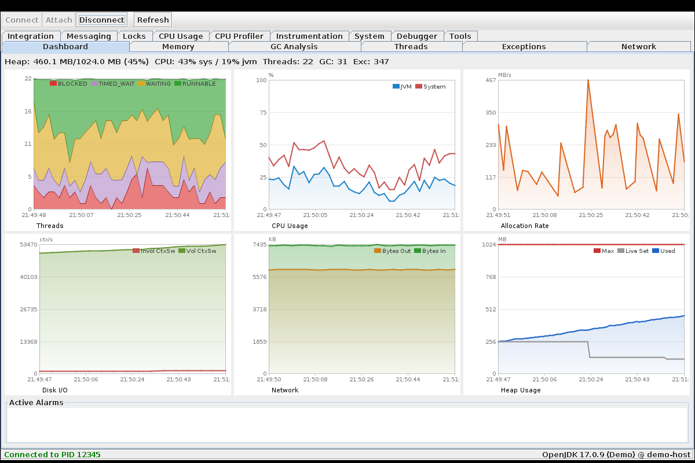

The Dashboard provides a 2x3 grid of real-time mini-charts with a summary bar and alarm panel:

**Top row (left to right):**
- **Threads** — Stacked area chart showing thread state distribution over time. BLOCKED (red) at the bottom, TIMED_WAITING (purple), WAITING (orange), RUNNABLE (green) at the top.
- **CPU Usage** — Dual-line chart: System CPU (red) and JVM CPU (blue) with gradient fill. Fixed Y axis 0-100%.
- **Allocation Rate** — Line chart showing memory allocation speed in MB/s, computed from GC events.

**Bottom row (left to right):**
- **Disk I/O** — Context switches per second (voluntary and involuntary) as a proxy for I/O activity.
- **Network** — Bytes In (green) and Bytes Out (orange) delta per snapshot interval in KB.
- **Heap Usage** — Three lines: Used heap (blue with gradient fill), Live Set (gray, the minimum heap level — only drops after Full GC), Max heap (red).

**Summary bar** (top): Heap usage, CPU percentages, thread count, GC count, exception count.

**Active Alarms** (bottom): List of currently active alarms with severity coloring (red = CRITICAL, orange = WARNING).

All charts show HH:mm:ss time labels on the X axis and update every 2 seconds. Hover over any chart to see a tooltip with exact values at the cursor position, with a vertical cursor line and colored dots on each series.

## Tab 2: Memory

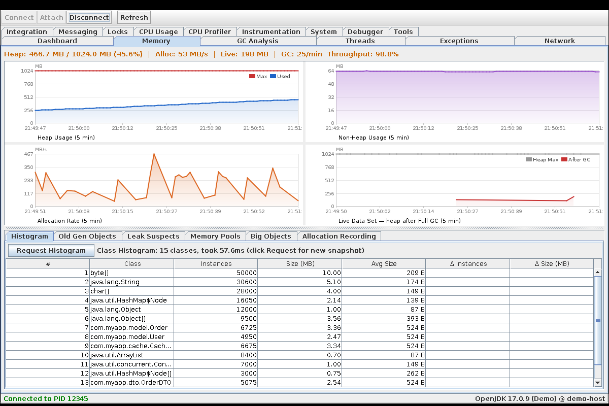

The Memory tab is split vertically into two halves:

**Top half — 4 charts in a 2x2 grid:**
- **Heap Usage** (top-left) — Area chart with gradient fill showing heap used over time.
- **Non-Heap Usage** (top-right) — Area chart for Metaspace/PermGen/Code Cache.
- **Allocation Rate** (bottom-left) — MB/s allocation rate computed between GC events.
- **Live Data Set** (bottom-right) — Heap after Full GC. A rising trend here indicates a real memory leak.

**Bottom half — 6 sub-tabs:**

| Sub-tab | Description |
|---|---|
| **Histogram** | Class histogram with manual "Request Histogram" button. Shows #, Class, Instances, Size (MB), Avg Size, Delta Instances, Delta Size. Delta columns compare against the previous histogram. |
| **Old Gen Objects** | Classes with large total size in old generation (avg instance > 1 KB). Candidates for leak investigation. |
| **Leak Suspects** | Automated analysis identifying classes with growing instance counts across consecutive histograms. |
| **Memory Pools** | Visual bars for each memory pool (Eden, Survivor, Old Gen, Metaspace) showing used vs max. |
| **Big Objects** | Objects sorted by average instance size. Useful for finding oversized buffers or caches. |
| **Allocation Recording** | Start/stop allocation tracking. Shows allocations aggregated by class with allocation site (where the object was created). |

**Note:** Requesting a class histogram pauses the JVM for 0.5-5 seconds. The button is intentionally manual to avoid accidental pauses in production.

## Tab 3: GC Analysis

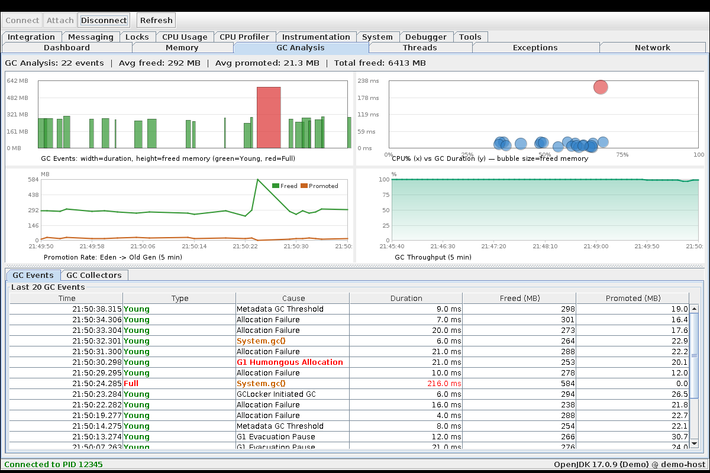

**Top half — 4 charts in a 2x2 grid:**
- **GC Rectangle Chart** (top-left) — Each GC event as a rectangle: width = duration, height = freed memory. Green = Young GC, Red = Full GC.
- **CPU vs GC Correlation** (top-right) — Bubble chart correlating GC pause duration with CPU usage at GC time. Large bubbles at high CPU suggest GC-induced CPU saturation.
- **Promotion Rate** (bottom-left) — MB promoted from Eden to Old Gen per GC cycle. A high promotion rate fills Old Gen faster.
- **GC Throughput** (bottom-right) — Percentage of time spent in application code (not GC). Below 95% indicates GC pressure.

**Bottom half — 2 sub-tabs:**

| Sub-tab | Description |
|---|---|
| **GC Events** | Table of recent GC events: Time, Type (Young/Full), Cause, Duration (ms), Freed (MB), Promoted (MB). |
| **GC Collectors** | Per-collector details: name, collection count, cumulative time, managed memory pools. |

## Tab 4: Threads

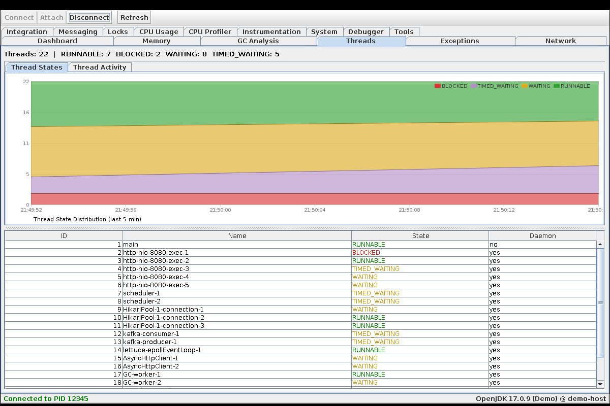

**Top half** with 2 sub-tabs:
- **Thread States** — Stacked area chart of thread state distribution over the last 5 minutes. States stacked bottom-to-top: BLOCKED (red), TIMED_WAITING (purple), WAITING (orange), RUNNABLE (green). Problematic states at the bottom make contention visually prominent.
- **Thread Activity** — Stacked area chart classifying threads by what they are doing: DATABASE, NETWORK, DISK I/O, MESSAGING, WEB SERVICE, LOCK WAIT, APPLICATION, OTHER. Includes name filter (regex) and package filter fields.

**Bottom half** — Thread table with columns: ID, Name, State, Daemon. States are color-coded: RUNNABLE (green), BLOCKED (red), WAITING/TIMED_WAITING (orange). The table is sortable by clicking column headers. Right-click for CSV export.

## Tab 5: Exceptions

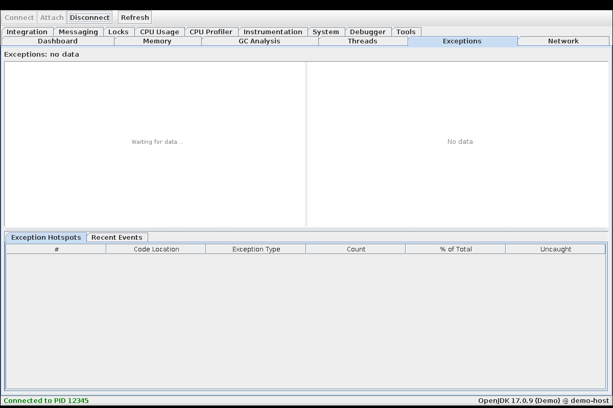

**Top half — 2 charts:**
- **Exception Rate** (left) — Line chart showing exceptions per minute over the last 5 minutes.
- **Top Exception Classes** (right) — Horizontal bar chart ranking the most frequent exception types.

**Bottom half — 2 sub-tabs:**

| Sub-tab | Description |
|---|---|
| **Exception Hotspots** | Table: #, Code Location, Exception Type, Count, % of Total, Uncaught count. Sorted by frequency. Identifies the exact code locations throwing the most exceptions. |
| **Recent Events** | Table of individual exception events: Exception class, Thrown At (class.method), Caught? (yes/NO). Click a row to view the full stack trace. |

## Tab 6: Network

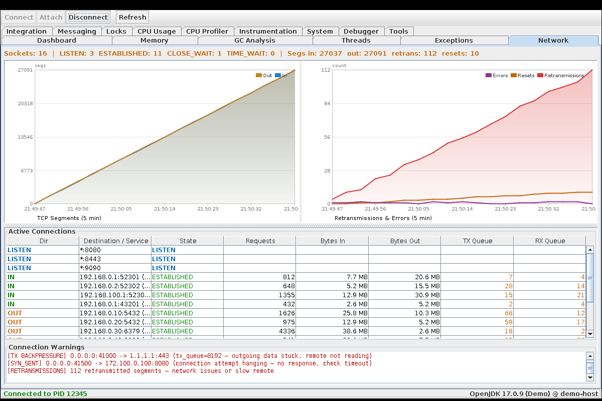

**Summary bar** (top): Socket count, states (LISTEN, ESTABLISHED, CLOSE_WAIT, TIME_WAIT), segment counts, retransmissions, errors.

**Top half — 2 charts:**
- **TCP Segments** (left) — Line chart of in/out segments over time.
- **Retransmissions & Errors** (right) — Retransmissions (red area), Resets (orange), Errors (purple).

**Bottom half — Active Connections table:** Dir (IN/OUT/LISTEN), Destination/Service, State, Requests, Bytes In, Bytes Out, TX Queue, RX Queue. Color-coded: CLOSE_WAIT in red, LISTEN in blue.

**Connection Warnings** (bottom): Automated detection of issues:
- TX BACKPRESSURE: outgoing data stuck, remote not reading
- SYN_SENT: connection attempt hanging
- RETRANSMISSIONS: network packet loss

## Tab 7: Integration

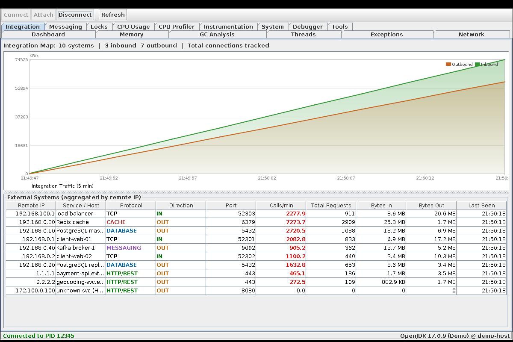

External systems grouped by remote IP address. Auto-detects protocol type based on port:

| Port range | Detected type |
|---|---|
| 3306, 5432, 1521, 1433 | DATABASE |
| 6379, 11211 | CACHE |
| 5672, 61616, 9092 | MESSAGING |
| 80, 443, 8080, 8443 | HTTP/REST |
| 25, 465, 587, 143, 993 | MAIL |
| 21, 22 | FTP/SFTP |
| 389, 636 | DIRECTORY (LDAP) |

Columns: System (IP), Protocol, Connections, Calls/min, Bytes In, Bytes Out, Avg Latency.

## Tab 8: Messaging

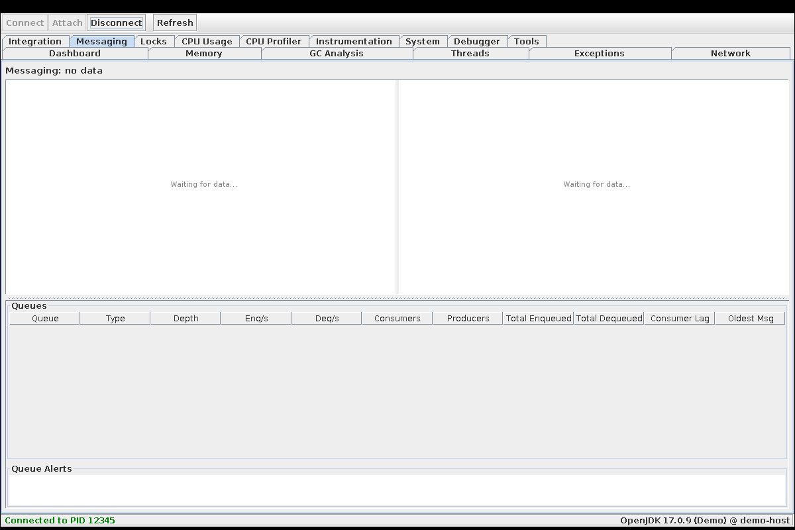

Message queue monitoring for JMS, Kafka, RabbitMQ, ActiveMQ:

**Top half — 2 charts:**
- **Queue Depth** (left) — Stacked area chart of message depth per queue.
- **Rates** (right) — Enqueue/dequeue rates over time.

**Bottom half — Queue table:** Queue name, Type, Depth, Enqueue/s, Dequeue/s, Consumers, Producers, Consumer Lag, Oldest Message Age. Depth > 1000 highlighted in red. Alerts for backlog accumulation and stale messages.

## Tab 9: Locks

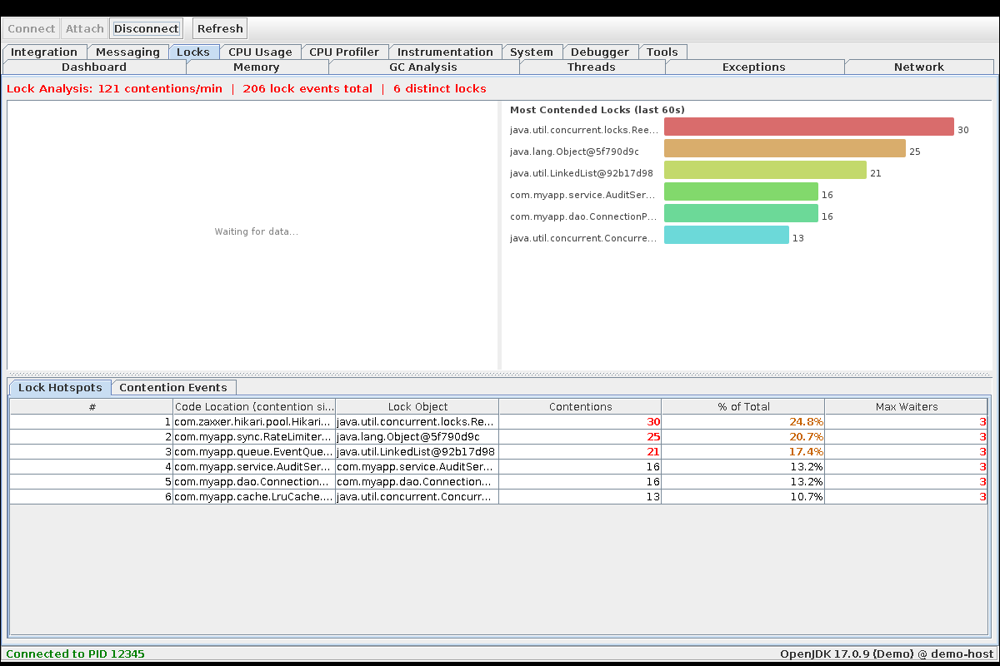

**Top half — 2 charts:**
- **Contention Rate** (left) — Lock contention events per second over time.
- **Lock Hotspots** (right) — Horizontal bar chart of the most contended locks.

**Bottom half — 2 sub-tabs:**

| Sub-tab | Description |
|---|---|
| **Lock Hotspots** | Table: Lock class, Contentions, Avg Wait, Max Wait, Code Location. |
| **Contention Events** | Individual events: Thread, Lock, Owner Thread, Entry Count, Waiter Count, Stack trace. |

## Tab 10: CPU Usage

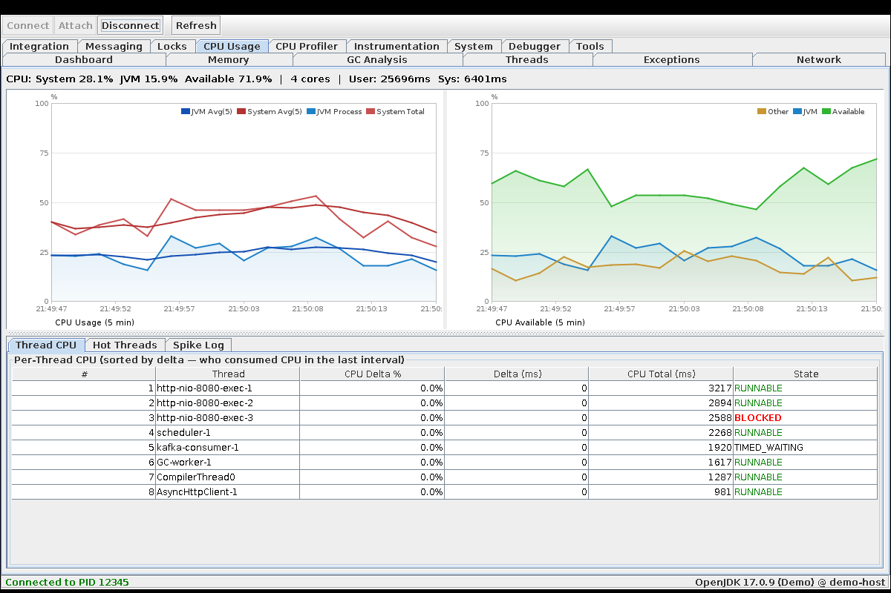

**Top half — 2 charts:**
- **CPU Usage** (left) — System CPU (red) and JVM CPU (blue) with 5-period moving average (dashed line).
- **CPU Distribution** (right) — Stacked area of CPU time breakdown.

**Bottom half:**
- **Thread CPU Table** — Per-thread CPU delta: Thread ID, Name, CPU%, CPU Time, State. Sorted by CPU% descending. Hot threads (>10% CPU) highlighted in red.
- **Hot Threads** — Automatic detection of threads consuming disproportionate CPU.
- **Spike Log** — Auto-captured CPU spike events with timestamp and top thread at spike time.

## Tab 11: CPU Profiler

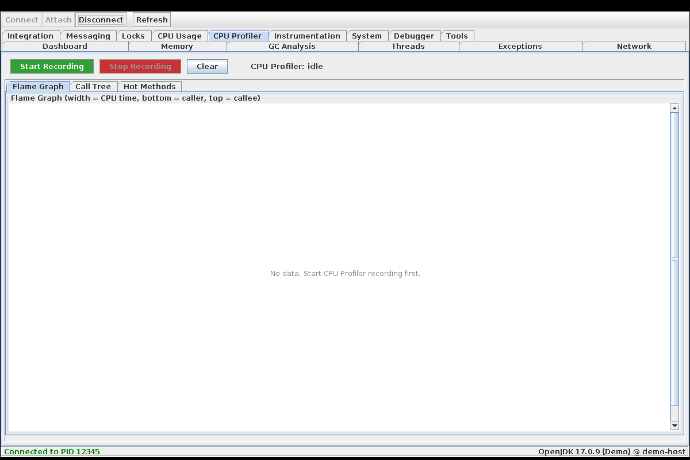

Sampling-based CPU profiler with start/stop recording:

**Control bar:** Start Recording (green button), Stop (red button), status label showing sample count and elapsed time. During recording, charts update live every 2 seconds.

**3 sub-tabs:**

| Sub-tab | Description |
|---|---|
| **Flame Graph** | Interactive flame graph visualization. Each bar = a method, width = sample count (proportional to CPU time). Click to zoom into a subtree. Hover for tooltip with method name and sample count. |
| **Call Tree** | Expandable tree-table (TraceTreeTable) showing the call hierarchy. Columns: Method, Duration (ms), %, Context. Click arrows to expand/collapse nodes. |
| **Hot Methods** | Flat list of the hottest methods sorted by self sample count with percentage bars. |

## Tab 12: Instrumentation

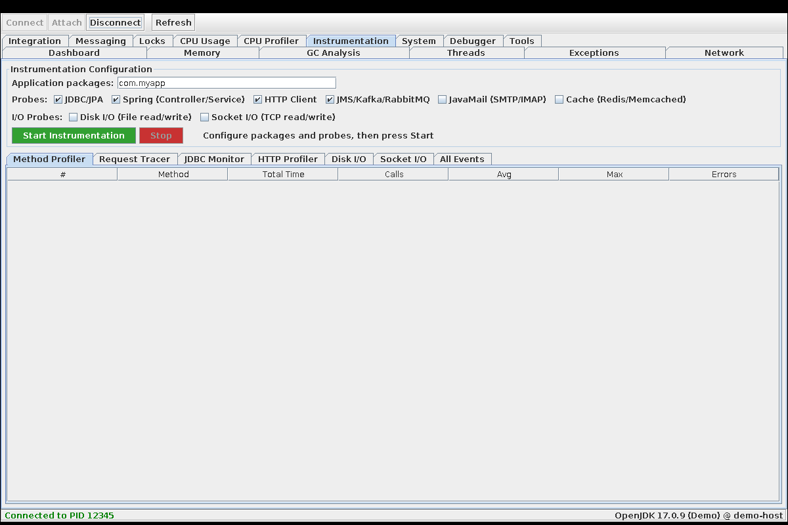

JVMTI method entry/exit tracing with configurable probes.

**Configuration bar (top):**
- Application packages field (e.g., `com.myapp`)
- Probe checkboxes: JDBC/JPA, Spring, HTTP Client, JMS/Kafka/RabbitMQ, JavaMail, Cache/Redis
- I/O Probes (off by default): Disk I/O, Socket I/O
- Start/Stop buttons

**7 sub-tabs:**

| Sub-tab | Description |
|---|---|
| **Method Profiler** | Aggregated by method: Method, Total Time, Calls, Avg, Max, Exceptions. Sorted by total time. |
| **Request Tracer** | Expandable tree-table showing end-to-end call chains. Each request is a tree with method, duration, % of parent, context. |
| **JDBC Monitor** | 3 nested sub-tabs: **SQL Statistics** (aggregated by query pattern), **SQL Events** (individual executions), **Connection Monitor** (open connections with thread, open time, duration — detects leaks). |
| **HTTP Profiler** | HTTP requests aggregated by URL: Method+URL, Count, Avg (ms), Max (ms), P95, Errors, Error%. |
| **Disk I/O** | File operations by thread: Thread, Operation (READ/WRITE), File Path, Bytes, Duration, Count. Requires Disk I/O probe enabled. |
| **Socket I/O** | Socket operations by thread: Thread, Operation (READ/WRITE/CONNECT/CLOSE), Remote Address, Bytes, Duration, Count. Requires Socket I/O probe enabled. |
| **All Events** | Raw event table with all instrumentation events. |

## Tab 13: System

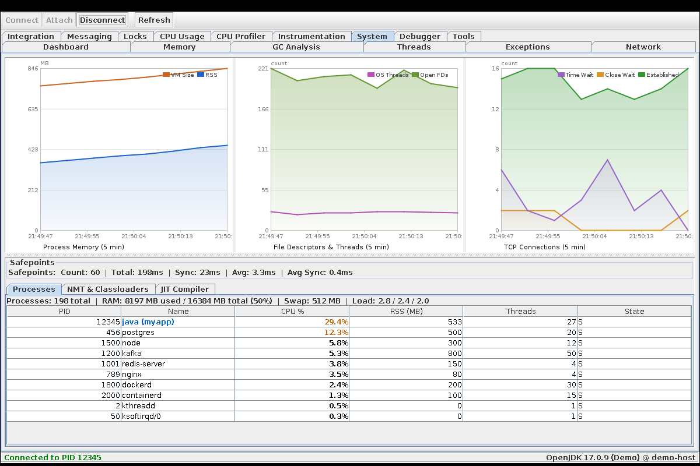

OS-level metrics and JVM internals.

**Top row — 3 mini time-series charts:**
- RSS + VM Size (dual-line)
- Open FDs + OS Threads (dual-line)
- TCP connections stacked (Established, Close_Wait, Time_Wait)

**Middle:** Safepoint stats (count, avg time, avg sync time), Native Memory (NMT output), Classloader breakdown table (loader class, class count).

**Bottom:** JIT compiler events table (timestamp, class.method, code size, type), Process list (PID, name, CPU%, RSS, threads).

## Tab 14: Debugger

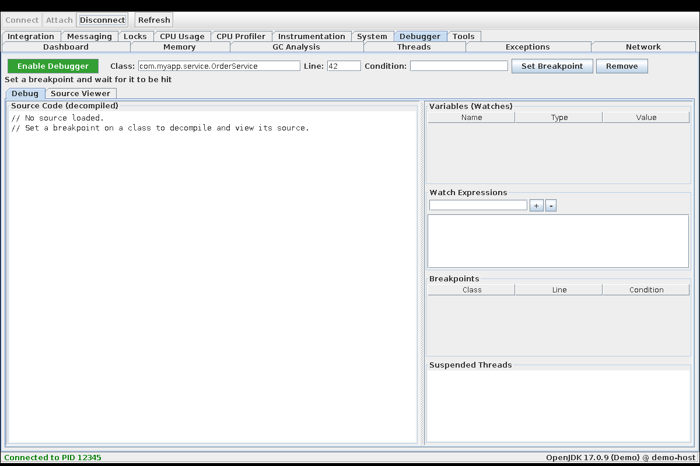

Remote debugging with integrated decompiler.

**Control bar (top):**
- **Enable/Disable Debugger** toggle button (green = enabled)
- Class name field, Line number, Condition (optional)
- Set Breakpoint / Remove buttons
- Resume (F8), Step Over (F6), Step Into (F5) buttons

**Left panel — 2 sub-tabs:**
- **Debug** — Source code panel showing decompiled class source with syntax highlighting (keywords blue, strings green, comments gray, numbers red, annotations olive). Line numbers on the left. Breakpoint lines highlighted.
- **Source Viewer** — Browse and decompile any class from the target JVM.

**Right panel:**
- **Variables (Watches)** — Variable name, type, and value at the current breakpoint.
- **Watch Expressions** — Add custom expressions to evaluate at each breakpoint.
- **Breakpoints** — List of all set breakpoints with class, line, and condition.
- **Suspended Threads** — Threads currently stopped at breakpoints.

## Tab 15: Tools

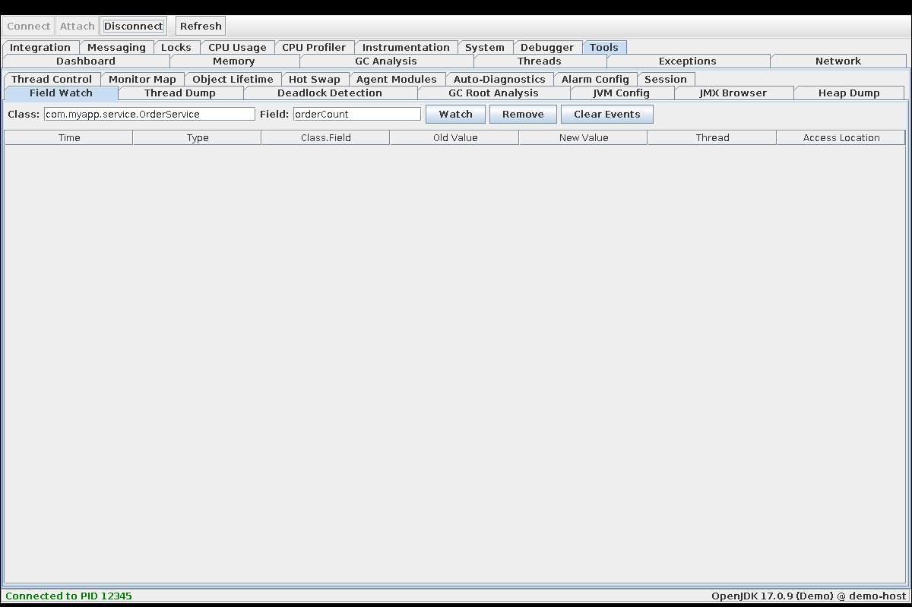

17 sub-tabs with advanced diagnostic tools:

| Sub-tab | Description |
|---|---|
| **Field Watch** | Monitor field read/write events. Enter class and field name, receive notifications with old/new value and access location. |
| **Thread Dump** | Capture full thread dump with stack traces. Save to file button. |
| **Deadlock Detection** | Run deadlock detection. Shows chain visualization if a cycle is found. |
| **GC Root Analysis** | Enter a class name to trace reference chains from GC roots. Explains why objects of that class cannot be garbage collected. Force GC button. |
| **JVM Config** | Startup parameters (-Xmx, -XX flags), system properties, classpath. Read-only. |
| **JMX Browser** | Navigate and inspect JMX MBeans. Tree structure on the left, attributes on the right. |
| **Heap Dump** | Trigger a .hprof heap dump on the agent host. Specify file path. |
| **Thread Control** | Suspend, resume, or stop individual threads by ID. Use with caution. |
| **Monitor Map** | Shows which threads hold which monitors (locks) and who is waiting. |
| **Object Lifetime** | Start/stop object lifetime tracking. Shows lifetime distribution: short-lived, promoted to old gen, never freed. |
| **Hot Swap** | Upload a .class file to replace a class at runtime via JVMTI RedefineClasses. |
| **Agent Modules** | List all 15 agent modules with current level, max level, and status. Enable/disable directly. |
| **Auto-Diagnostics** | Run all 9 diagnostic rules. Shows findings with severity, category, problem, evidence, and suggested action. |
| **Alarm Config** | Editable table of all 32 alarm threshold parameters. Apply, Save to File (.thresholds), Load from File, Reset Defaults buttons. |
| **Session** | Save Session (compressed .jvmsession.gz), Load Session (replay), Export HTML Report. |

## Charts

All charts in JVMMonitor share these features:

- **Gradient fills** — Area charts use semi-transparent gradient fills from the line color to transparent.
- **Tooltips** — Hover over any chart to see a tooltip with colored bullet points for each series, showing the exact value at the cursor position.
- **Cursor line** — A vertical dashed line follows the cursor, with colored dots on each series at the intersection point.
- **Time labels** — X axis shows HH:mm:ss labels, auto-scaled.
- **Auto-scale** — Y axis auto-scales to fit data, except for percentage charts (fixed 0-100%).
- **Legend** — Multi-series charts show a legend in the top-right corner.

## Tables

All tables share these features:

- **Sortable** — Click any column header to sort ascending/descending.
- **Right-aligned numbers** — Numeric columns are right-aligned, text columns left-aligned.
- **CSV Export** — Right-click any table for a context menu with "Export to CSV..." option.
- **Color-coded** — Critical values highlighted in red, warnings in orange.

## Alarm System

JVMMonitor uses an intelligent, contextual alarm system. Alarms are not based on simple thresholds but on understanding JVM behavior:

| Alarm | Logic |
|---|---|
| **Memory Leak** | Live set (heap after Full GC) growing across 3+ consecutive Full GCs — not just heap usage % |
| **Old Gen Exhaustion** | Old Gen still > 80% after Full GC — GC cannot free enough |
| **Allocation Pressure** | Allocation rate > reclaim rate for sustained period |
| **GC Thrashing** | GC throughput < 90% (too much time in GC) |
| **CPU Saturation** | JVM CPU > 80% sustained, with GC correlation analysis |
| **Runaway Thread** | Single thread > 50% CPU |
| **Lock Contention** | > 20% threads BLOCKED with lock hotspot identification |
| **Deadlock** | Lock cycle detected |
| **Exception Storm** | Rate spike > 3x vs 5-minute baseline |
| **Uncaught Exception** | Always CRITICAL — thread is dying |
| **Response Degradation** | Response time > 2x vs baseline for instrumented methods |
| **Connection Leak** | CLOSE_WAIT count growing over time |

All thresholds are configurable via **Tools > Alarm Config**.

## Session Management

### Save Session
**Tools > Session > Save Session** saves all collected data (memory, GC, threads, exceptions, CPU, network, locks, instrumentation, etc.) to a compressed binary file (`.jvmsession.gz`). Typical size: 100-500 KB for a 5-minute session.

### Load Session
**Tools > Session > Load Session** loads a previously saved session. All tabs and charts are populated with the saved data, allowing offline analysis and comparison.

### Export HTML
**Tools > Session > Export HTML Report** generates a comprehensive HTML report with all metrics, suitable for sharing with team members or attaching to incident tickets.

## Keyboard Shortcuts

| Shortcut | Action (in Debugger tab) |
|---|---|
| F5 | Step Into |
| F6 | Step Over |
| F8 | Resume |

## Typical Workflows

### Memory Leak Investigation
1. Open **Dashboard** — check Heap Usage chart for rising trend
2. Switch to **Memory** — observe Live Data Set chart (should be flat; rising = leak)
3. Run **Tools > Auto-Diagnostics** — look for "Memory Leak" finding
4. Click **Histogram** sub-tab, press "Request Histogram", wait 5 minutes, press again
5. Compare delta columns to find classes with growing instance count
6. Check **Old Gen Objects** and **Leak Suspects** sub-tabs

### Performance Profiling
1. Go to **CPU Profiler**, click "Start Recording"
2. Generate load on the application
3. Switch between Flame Graph, Call Tree, and Hot Methods to identify bottlenecks
4. Go to **Instrumentation**, configure probes, click "Start Instrumentation"
5. Check Method Profiler for slow methods, JDBC Monitor for slow queries

### Production Incident Response
1. Check **Dashboard** for overview — alarms, CPU, heap, threads
2. Run **Tools > Auto-Diagnostics** for intelligent analysis
3. Save session: **Tools > Session > Save Session** (for later analysis)
4. Investigate specific areas based on diagnosis findings
5. Export HTML report: **Tools > Session > Export HTML Report**
